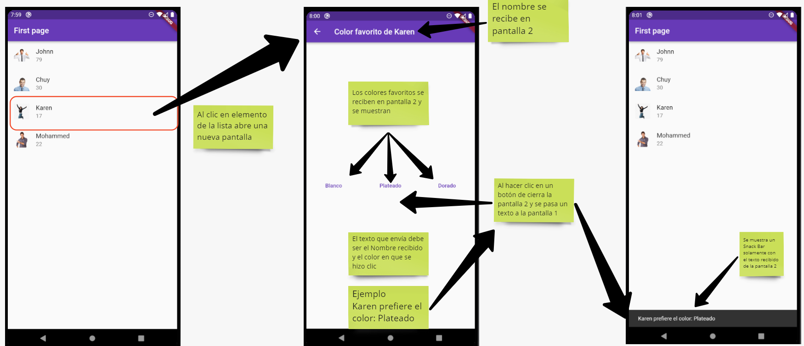

# App 5

App para practicar navegacion entre pantallas y paso de parametros de A->B y de B->A

## Getting Started

Recuerda que despues de clonar el proyecto, abrir una terminal dentro de la carpeta del proyecto y ejecutar el comando:

```sh
flutter packages get
``` 

## App Screenshot





